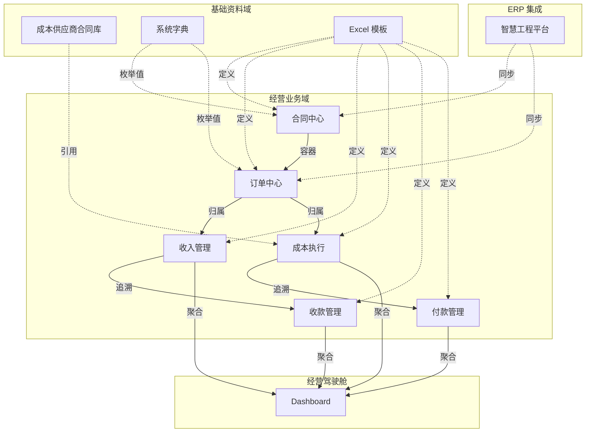

# FinanceDesk 业务架构

> **永久文档 · Single Source of Truth**
> 更新时间：2026-07-04（BDD-00 重构：划分为经营业务域 / 基础资料域 / ERP / Dashboard）
> 交叉引用：[Business_Master_Data](./Business_Master_Data.md) · [02_Business_Model](./02_Business_Model.md) · [04_Data_Model](./04_Data_Model.md) · [07_System_Architecture](./07_System_Architecture.md)

---

## 1. 业务域划分

> **BDD-00 补充：成本供应商合同库被重新定义为基础资料（Master Data），不参与经营流程。**

```
┌─────────────────────────────────────────────────────────────────────┐
│                      FinanceDesk 业务架构                             │
├─────────────────────┬──────────────────────┬──────────┬─────────────┤
│    经营业务域         │    基础资料域         │ ERP 集成 │   经营驾驶舱 │
│  (Transaction Data) │  (Master Data)        │          │  (Dashboard)│
├─────────────────────┼──────────────────────┼──────────┼─────────────┤
│ ① 合同中心          │ ⑤ 成本供应商合同库     │ 财务集成  │ 经营驾驶舱   │
│ ② 订单中心          │ ⑥ 系统字典            │ 核对     │             │
│ ③ 收入/收款         │ ⑦ Excel 模板          │          │             │
│ ④ 成本执行/付款     │ ⑧ 参数配置            │          │             │
├─────────────────────┴──────────────────────┴──────────┴─────────────┤
│                      横切能力                                       │
│   审计日志  ·  逻辑删除  ·  数据来源标记（source_type）               │
│   Excel 导入导出  ·  ERP 双轨 ETL  ·  系统字典配置                   │
└─────────────────────────────────────────────────────────────────────┘
```

## 2. 模块依赖关系

```
┌─ 基础资料域（Master Data） ─────────────────────┐
│  成本供应商合同库  ──被引用──→  成本执行/付款      │
│  系统字典          ──被引用──→  全部模块          │
│  Excel 模板        ──定义──→   全部模块          │
└─────────────────────────────────────────────────┘
                         │ 引用
                         ▼
┌─ 经营业务域（Transaction Data） ─────────────────┐
│  合同中心 (Project)                               │
│    └── 订单中心 (Order)                           │
│          ├── 收入管理 (IncomeFlow) ──→ 收款 (Collection) │
│          └── 成本执行 (CostFlow)  ──→ 付款 (Payment)     │
└─────────────────────────────────────────────────┘
                         │
                         ▼
┌─ 经营驾驶舱 ────────────────────────────────────┐
│  Dashboard (只读分析层)                          │
└─────────────────────────────────────────────────┘
```

## 3. 数据流方向



### 数据流向规则

| 规则 | 说明 |
|------|------|
| **基础资料→业务** | Master Data 被业务引用，不参与流程 |
| **业务→业务** | 数据在经营业务域内单向流转：合同→订单→流水→收付款 |
| **业务→Dashboard** | Dashboard 从业务数据聚合，只读 |
| **ERP→业务** | ERP 数据单向同步到业务表，不可反写 |

## 4. 模块说明

### 4.1 经营业务域（Transaction Data）

#### 合同中心（Contract Center）
- **Router**: `app/routers/project.py`
- **前端**: `ProjectList.tsx` / `ProjectModal.tsx`
- **CRUD**: 5 端点
- **定义**: 框架合同/单项合同，包含业主信息（甲方单位）

#### 订单中心（Order Center）
- **Router**: `app/routers/order.py`
- **前端**: `OrderPage.tsx` / `OrderModal.tsx`
- **CRUD**: 5 端点
- **定义**: 唯一经营结算单元（**R001**），承接合同中心，衍生收入/成本

#### 收入管理（Income Management）
- **Router**: `app/routers/flow.py`（收入部分）
- **CRUD**: 5 端点（list/create/get/patch/delete）
- **定义**: 按订单维度的开票记录

#### 成本执行（Cost Execution）
- **Router**: `app/routers/flow.py`（成本部分）
- **CRUD**: 5 端点
- **定义**: 按订单维度的成本支出记录，引用成本供应商合同库

#### 收款管理（Collection Management）
- **Router**: `app/routers/collection_payment.py`（`collection_router`）
- **前端**: `CollectionPage.tsx` / `CollectionManagement.tsx`
- **CRUD**: 5 端点 (prefix `/collection`)
- **定义**: 回款记录，关联收入流水

#### 付款管理（Payment Management）
- **Router**: `app/routers/collection_payment.py`（`payment_router`）
- **前端**: `PaymentManagement.tsx`
- **CRUD**: 5 端点 (prefix `/payment`)
- **定义**: 付款记录，关联成本流水

### 4.2 基础资料域（Master Data）

| 模块 | 说明 | 详细文档 |
|------|------|---------|
| 成本供应商合同库 | 年度合同单价体系，被成本执行引用 | [Business_Master_Data.md](./Business_Master_Data.md) §2 |
| 系统字典 | 枚举值管理，10 分类 44 条种子 | [04_Data_Model.md](./04_Data_Model.md) §7 |
| Excel 模板 | 9 种导入模板，存于 `backend/templates/` | [05_Data_Source.md](./05_Data_Source.md) §3 |
| 参数配置 | 系统级参数（待 pydantic-settings 实现） | — |

### 4.3 ERP 集成

详见 [06_ERP_Integration.md](./06_ERP_Integration.md)。

### 4.4 经营驾驶舱（Dashboard）

- **Router**: `app/routers/dashboard.py`
- **前端**: `Dashboard.tsx`
- **端点**: project-summary / project-profit / order-detail / ar-aging
- **定义**: 只读分析层（**R005**），禁止录入

## 5. 跨模块能力

| 能力 | 实现 | 说明 |
|------|------|------|
| Excel 导入 | 9 种模板，`data_import.py` | 详见 [05_Data_Source.md](./05_Data_Source.md) |
| 系统字典（SysDictionary） | `dict` 表 + API `/dict/{category}` | 字典化 Select，支持运行时扩充 |
| 审计日志 | `audit_log` 表 + `audit.py` 工具 | 关键操作记录 |
| 逻辑删除 | `is_deleted` 字段（所有模型继承） | 统一软删除，非物理删除 |
| 数据来源标记 | `source_type` 字段 | 遵循 R004，三分法（人工/ERP/系统） |
