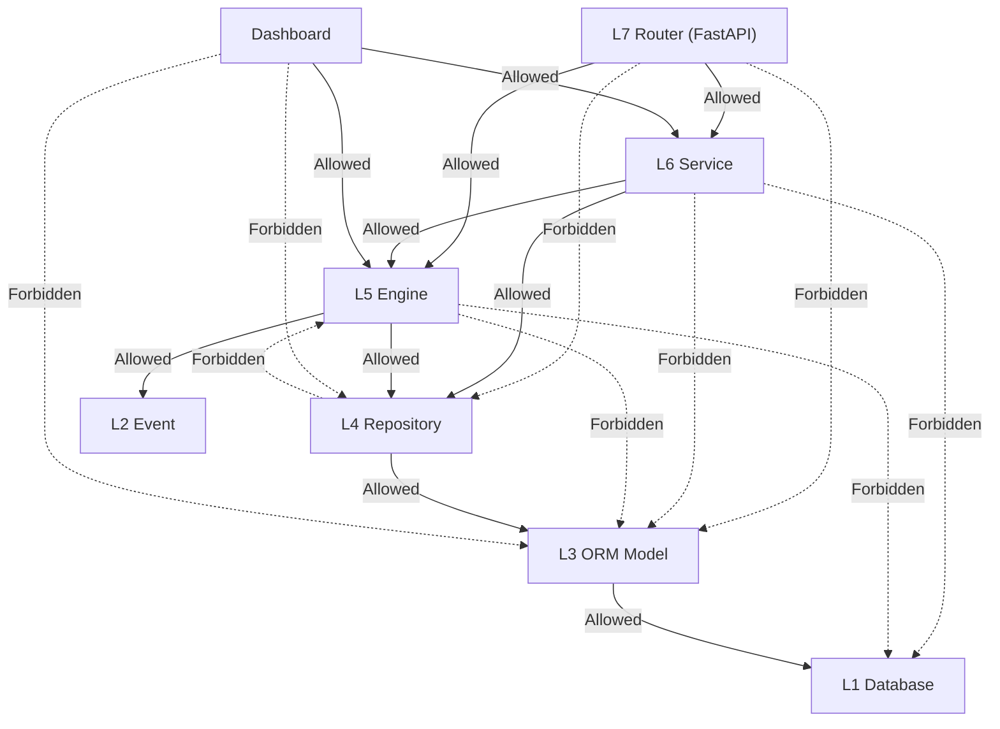

# Architecture Dependency — 系统层间调用依赖

> **AHF-01.5 P1 输出 · 永久文档（Technical SSoT）**
> 更新时间：2026-07-06
> **定义 FinanceDesk 各层之间唯一允许的调用关系。任何后续开发必须遵守，不得绕过。**

---

## 一、系统标准分层

```
┌──────────────────────────────────────────────────────────────┐
│  L7  Router         FastAPI 路由层，HTTP 入口                │
├──────────────────────────────────────────────────────────────┤
│  L6  Service        非 Engine 业务编排层                      │
├──────────────────────────────────────────────────────────────┤
│  L5  Engine         核心业务引擎层（Mapping/Rule/Import/Summary）│
├──────────────────────────────────────────────────────────────┤
│  L4  Repository     ORM 数据访问层（唯一 ORM 入口）           │
├──────────────────────────────────────────────────────────────┤
│  L3  ORM Model      SQLAlchemy 模型层                        │
├──────────────────────────────────────────────────────────────┤
│  L2  Event          标准业务事件层（跨 Engine 通信）           │
├──────────────────────────────────────────────────────────────┤
│  L1  Database       SQLite / PostgreSQL                      │
└──────────────────────────────────────────────────────────────┘
```

---

## 二、各层职责定义

| 层 | 职责 | 文件位置 |
|:--:|------|---------|
| **L7 Router** | HTTP 请求路由、参数校验、响应序列化 | `routers/*.py` |
| **L6 Service** | 非 Engine 业务编排、跨 Engine 协调 | `services/*.py` |
| **L5 Engine** | 核心业务逻辑执行、事务管理 | 内联在 Router 或独立 Engine 文件 |
| **L4 Repository** | 数据 CRUD、字段映射、存在性检查 | `repositories/*.py` |
| **L3 ORM Model** | 表结构映射、约束定义 | `models/*.py` |
| **L2 Event** | 业务事件定义、事件生成/消费 | 内联在 Engine |
| **L1 Database** | 数据持久化 | SQLite / PostgreSQL |

### 辅助层

| 层 | 职责 | 文件位置 |
|:--:|------|---------|
| **Dashboard** | 只读分析展示 | `pages/*.tsx` + Router |
| **AI** | AI Agent 集成 | `plugins/ai/` |
| **Plugin** | 第三方扩展 | `plugins/*/` |

---

## 三、调用方向示意图



---

## 四、每层允许/禁止调用对象

### L7 Router

| 调用目标 | 许可 | 说明 |
|:---------|:----:|------|
| L6 Service | ✅ Allowed | 主要调用方向 |
| L5 Engine | ✅ Allowed | 直接调用 Engine（如 engine_execute） |
| L4 Repository | ❌ **Forbidden** | 必须通过 Engine/Service |
| L3 ORM Model | ❌ **Forbidden** | 禁止直接访问 ORM |
| L2 Event | ❌ **Forbidden** | Event 由 Engine 生成 |

### L6 Service

| 调用目标 | 许可 | 说明 |
|:---------|:----:|------|
| L5 Engine | ✅ Allowed | 主要调用方向 |
| L4 Repository | ✅ Allowed | 非 Engine 场景直接数据访问 |
| L3 ORM Model | ❌ **Forbidden** | 必须通过 Repository |
| L1 Database | ❌ **Forbidden** | 禁止直连数据库 |
| L2 Event | ⚠️ Restricted | 仅在 Engine 上下文中使用 |

### L5 Engine

| 调用目标 | 许可 | 说明 |
|:---------|:----:|------|
| L4 Repository | ✅ Allowed | **唯一**数据访问通道 |
| L2 Event | ✅ Allowed | 生成/消费业务事件 |
| L6 Service | ❌ **Forbidden** | 禁止反向调用 |
| L3 ORM Model | ❌ **Forbidden** | 禁止直接 ORM 操作 |
| L1 Database | ❌ **Forbidden** | 必须通过 Repository→ORM |

### L4 Repository

| 调用目标 | 许可 | 说明 |
|:---------|:----:|------|
| L3 ORM Model | ✅ Allowed | **唯一**ORM 访问者 |
| L5 Engine | ❌ **Forbidden** | 禁止反向调用 |
| L6 Service | ❌ **Forbidden** | 禁止反向调用 |
| L1 Database | ⚠️ Restricted | 仅 ORM 内部使用 |
| 其他 Repository | ❌ **Forbidden** | 禁止交叉调用 |

---

## 五、Forbidden Dependency 清单

| # | 禁止路径 | 风险 | 合规依据 |
|:-:|:---------|:-----|:---------|
| 1 | **Router → Repository** | 绕过 Engine 直接操作数据 | AHF-01 |
| 2 | **Router → ORM** | 完全绕过分层 | AHF-01 |
| 3 | **Service → ORM** | 绕过了 Repository 的字段映射 | AHF-01 |
| 4 | **Engine → ORM** | 违反 Repository Standard | AHF-01 |
| 5 | **Engine → Service** | 循环依赖，Engine 不应调用 Service | 本文件 |
| 6 | **Engine → Database** | 绕过 ORM 直接操作数据库 | AHF-01 |
| 7 | **Repository → Engine** | 反向依赖，导致循环 | 本文件 |
| 8 | **Repository → Repository** | 交叉耦合 | 本文件 |
| 9 | **Dashboard → ORM** | 绕过 Engine 读取数据 | AHF-06 (规划) |
| 10 | **Dashboard → Repository** | 绕过 Engine 读取数据 | AHF-06 (规划) |
| 11 | **AI → ORM** | 绕过 Engine 直接访问 | AHF-07 (规划) |
| 12 | **Plugin → ORM** | 插件不应直接操作模型 | AHF-08 (规划) |
| 13 | **Event → ORM** | 事件不应包含数据操作 | AHF-04 (规划) |
| 14 | **Router → Event** | 路由层不应直接生成事件 | 本文件 |
| 15 | **Cross-Repository** | Repository 之间禁止互相调用 | 本文件 |

---

## 六、调用方向铁则

| 铁则 | 说明 |
|:----|------|
| **单向调用** | 调用方向始终向下（Router→Service→Engine→Repository→ORM） |
| **禁止反向** | 下层不允许调用上层 |
| **禁止跳跃** | 不允许跨层调用（如 Router→ORM） |
| **Repository 是唯一 ORM 入口** | 任何层不得绕过 Repository |
| **Engine 是唯一业务逻辑入口** | 业务规则必须在 Engine，不在 Router 或 Repository |

---

## 七、例外规则

| 例外 | 说明 | 审批要求 |
|:-----|:-----|:---------|
| Engine 内联在 Router | 如 erp.py 中 Engine 代码与 Router 共存 | 代码重构时必须分离 |
| 读取 SysDictionary | Router 可读取字典数据 | 仅限只读字典 |
| Health Check | Router 可直接检查 DB 连接 | 仅限 /health |
| 单元测试 | 测试代码不遵守分层限制 | 仅在 test 目录内 |

---

## 变更记录

| 版本 | 日期 | 变更说明 |
|------|------|---------|
| v1.0 | 2026-07-06 | 初始编制 |
