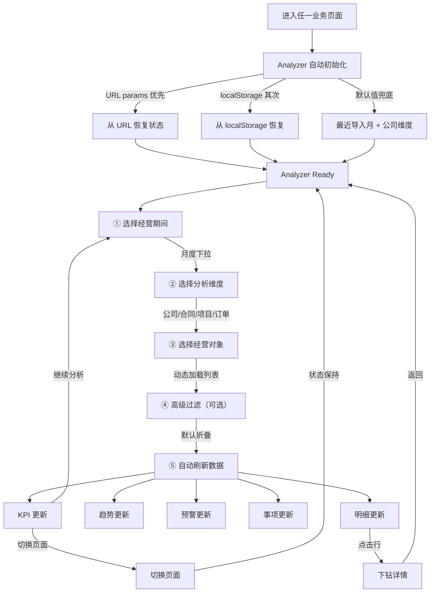

# Business Analyzer Flow — 经营分析器工作流

> **PDD-02 P4 输出 · 永久文档（Product SSoT）**
> 更新时间：2026-07-06
> **用户通过 Business Analyzer 完成经营分析的全流程。**

---

## 一、完整分析流程



---

## 二、用户工作流程

### 路径 A：月度经营检查（3 分钟）

```
进入 Dashboard
  → Analyzer 默认显示最近月份 + 公司维度
  → 查看 KPI 和趋势
  → 检查 Alerts
  → 完成
```

### 路径 B：合同级分析（5 分钟）

```
进入 Dashboard
  → 切换维度到「合同」
  → 选择具体合同
  → 查看该合同 KPI
  → 进入明细列表
  → 完成
```

### 路径 C：跨页面分析（10 分钟）

```
Dashboard（公司维度）→ 查看经营总览
  → 切换维度到「项目」
  → 选择项目 A
  → 点击明细 → 跳转合同中心
  → Analyzer 保持「项目 A」
  → 合同列表按项目 A 筛选
  → 跳转订单中心 → Analyzer 继续保持
  → 返回 Dashboard → 状态不变
```

---

## 三、数据刷新规则

| 变化 | 刷新范围 | API 调用 |
|:-----|:---------|:---------|
| 期间 | 全部 | `GET /dashboard/analytics?period=...` |
| 维度 | 全部 | 同上 |
| 对象 | Detail 区域 | `GET /dashboard/detail?object_id=...` |
| 过滤 | 当前视图 | `GET /dashboard/analytics?filters=...` |

---

## 四、异常处理

| 场景 | 行为 |
|:-----|:------|
| URL 参数无效 | 忽略 URL，使用 localStorage |
| localStorage 损坏 | 使用默认值 |
| 经营期间无数据 | 显示空状态「该期间暂无数据」 |
| API 错误 | 保留当前 Analyzer 状态，显示错误提示 |

---

## 变更记录

| 版本 | 日期 | 变更说明 |
|------|------|---------|
| v1.0 | 2026-07-06 | 初始编制 |
