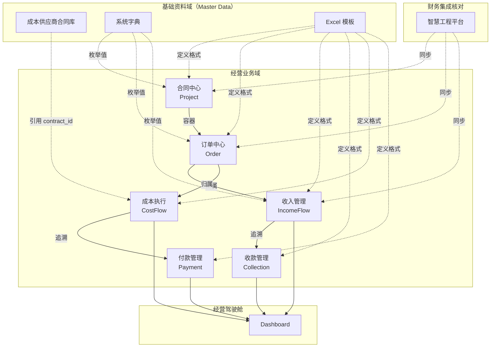

# Business Master Data — FinanceDesk 基础主数据体系

> **BDD-00 P1 输出 · 永久文档（SSoT）**
> 更新时间：2026-07-04
> 交叉引用：[Business_Constitution](./Business_Constitution.md) · [Business_Rules](./Business_Rules.md) · [04_Data_Model](./04_Data_Model.md)

---

## 一、主数据分类

主数据（Master Data）是 FinanceDesk 的**基础资料层**，不参与经营流程，仅被业务流程引用。

| # | 主数据 | 作用 | 生命周期 | 维护人 | 更新方式 |
|:-:|-------|------|---------|--------|---------|
| 1 | **合同（含业主信息）** | 记录框架合同/单项合同的基本信息、甲方业主资料 | 合同签订→作废/到期 | 项目经理 | 人工录入 / Excel 导入 |
| 2 | **成本供应商合同库** | 年度供应商合同单价体系，订单/成本执行时引用 | 年度签订→到期 | 财务人员 | Excel 导入（合同+单价模板） |
| 3 | **系统字典** | 枚举值管理（项目类型、订单状态、成本类型等） | 长期维护 | 系统管理员 | API 运行时扩充 |
| 4 | **Excel 模板** | 统一导入导出模板，定义各模块的字段集合 | 随模块更新 | 开发维护 | 版本管理 |
| 5 | **参数配置** | 系统级参数（数据库路径、端口、税率默认值等） | 长期维护 | 系统管理员 | 配置文件 / 环境变量 |

### 1.1 主数据特征

| 特征 | 说明 |
|------|------|
| **不参与流程** | 主数据仅作为引用源，不承担业务流转职责 |
| **独立维护** | 主数据通过独立入口维护，不依附于业务流程 |
| **被引用** | 业务流程（订单、成本执行）通过 ID 引用主数据 |
| **低频变更** | 主数据变更频率远低于业务数据 |
| **权威来源** | 每条主数据仅有一个权威来源 |

### 1.2 主数据与业务数据的关系

```
主数据（Master Data）                   业务数据（Transaction Data）
─────────────────                       ────────────────────
合同（框架/单项）          ──被引用──→   项目、订单
成本供应商合同库            ──被引用──→   成本流水、成本执行
系统字典                   ──被引用──→   所有模块的枚举字段
Excel 模板                 ──定义──→    所有模块的导入/导出格式
参数配置                   ──控制──→    系统级行为
```

---

## 二、成本供应商合同库

### 2.1 重新定义

> **Supplier 不再理解为传统供应商。定义为：年度成本供应商合同库。**
>
> 每一条记录代表一份年度合同，不是一个供应商主体。

### 2.2 字段定义

| # | 字段 | 说明 | 必填 |
|:-:|------|------|:----:|
| 1 | 合同编号 | 唯一标识（contract_no） | ✅ |
| 2 | 合同名称 | 框架合同名称 | ✅ |
| 3 | 所属年度 | 合同覆盖年度 | ✅ |
| 4 | 签订日期 | 签订时间 | |
| 5 | 开始日期 | 合同有效期开始 | |
| 6 | 结束日期 | 合同有效期结束 | |
| 7 | 合同状态 | 有效/作废/到期 | |
| 8 | 普工单价 | 普工日薪/单价 | |
| 9 | 技工单价 | 技工日薪/单价 | |
| 10 | 高级技工单价 | 高级技工日薪/单价 | |
| 11 | 特种作业单价 | 特种工种单价 | |
| 12 | 综合单价 | 综合计费单价 | |

> **所有单价均属于合同，不是供应商主体。**

### 2.3 与旧模型的映射

当前代码中有 5 张表与此相关：

| 表名 | 在合同库体系中的角色 | 状态 |
|------|---------------------|:----:|
| `supplier` | 合同库主表（合同名称+编号+年度） | 核心表 |
| `supplier_contract` | 合同补充信息（金额、状态） | 子表 |
| `supplier_price` | 旧单价表（兼容已有数据） | 历史遗留 |
| `supplier_year_price` | 年度综合单价 | 冗余（待合并） |
| `supplier_unit_price` | 按年度版本单价 | 子表 |

> **注**：上述表的合并/重构属于 BDD 阶段的工作，非当前任务。

---

## 三、业务职责

### 3.1 成本供应商合同库的职责

| 职责 | 说明 |
|:----:|------|
| ✅ 维护基础资料 | 合同编号、名称、年度、有效期、单价体系 |
| ❌ 录成本 | 成本通过 CostFlow 录入，按 order_id 归属 |
| ❌ 录付款 | 付款通过 Payment 录入，按 cost_id 归属 |
| ❌ 参与经营流程 | 合同库是引用源，不是流程节点 |

### 3.2 引用关系

```
成本供应商合同库（Master Data）
         │
         ▼   （引用：supplier_id）
成本执行（CostFlow）
         │
         ▼   （引用：cost_id）
付款（Payment）
         │
         ▼   （聚合）
Dashboard
```

### 3.3 关键约束

| 约束 | 说明 |
|------|------|
| 新增合同 | 年度变化应新增合同记录，不在原记录上覆盖年度 |
| 合同作废 | 逻辑删除（`is_deleted`），不影响已引用的成本记录 |
| 单价变更 | 年度内单价变更→新建单价版本合同，不在原合同上修改单价 |

---

## 四、数据流



### 数据流向总结

```
基础资料（Master Data）  →  被引用
     ↓
经营业务（Business Flow） →  产生经营数据
     ↓
Dashboard                 →  展示分析结果
```

---

## 变更记录

| 版本 | 日期 | 变更说明 |
|------|------|---------|
| v1.0 | 2026-07-04 | 初始编制，BDD-00 P1 产出 |
