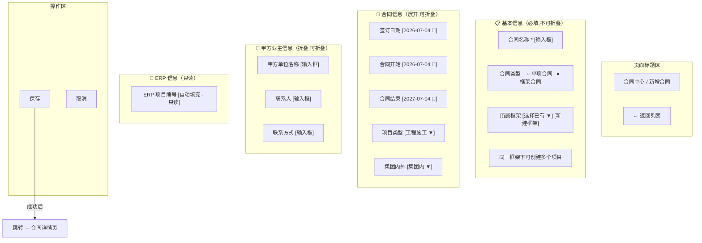
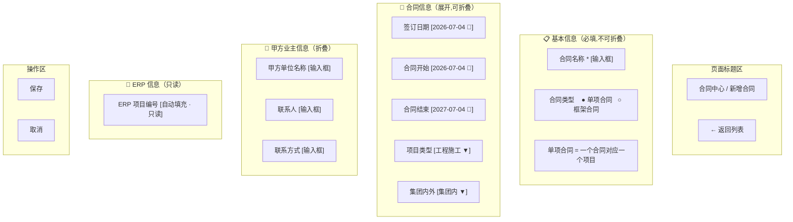
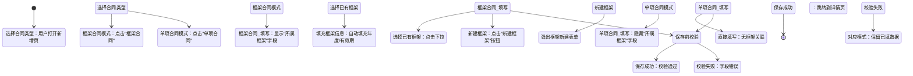

# Contract Entry UI — 合同新增页面 UI 草图

> **BDD-01 F0 输出 · UI 设计草图**
> 更新时间：2026-07-04
> 基于 Contract_Entry_Model.md 绘制

---

## 一、页面结构：框架合同模式



## 二、页面结构：单项合同模式



## 三、合同类型选择交互流程



## 四、合同详情页布局（参考）

```
合同中心 / 合同详情 — XX 项目框架合同              [← 返回列表] [✏️ 编辑]

┌─────────────────────────────────────────────────────────────────────┐
│  经营摘要                                                            │
│  ┌──────┐ ┌──────┐ ┌──────┐ ┌──────┐ ┌──────┐ ┌──────┐ ┌──────┐ │
│  │合同金额│ │预算金额│ │订单数│ │ 收入 │ │ 成本 │ │ 回款 │ │ 付款 │ │
│  │ ¥0    │ │ ¥0    │ │  0   │ │ ¥0   │ │ ¥0   │ │ ¥0   │ │ ¥0   │ │
│  └──────┘ └──────┘ └──────┘ └──────┘ └──────┘ └──────┘ └──────┘ │
│                                                          ┌──────┐ │
│                                                          │ERP   │ │
│                                                          │Gap   │ │
│                                                          │ ¥0   │ │
│                                                          └──────┘ │
└─────────────────────────────────────────────────────────────────────┘

基础信息               ┌──── Tab ──────────────────────────────────┐
─────────────────────  │                                          │
合同名称: XX 项目      │  📄 基本信息  |  📦 订单列表 | 💰 流水    │
合同类型: 框架合同      │  ──────────────────────────────────────    │
所属框架: 2026-年度框架 │  合同名称: XX 项目                          │
签订日期: 2026-01-15   │  集团内外: 集团内                           │
项目类型: 工程施工      │  项目类型: 工程施工                         │
状态: 待执行           │  签订日期: 2026-01-15                       │
                      │  [修改]                                    │
                      └──────────────────────────────────────────┘

📦 关联订单 (2)
  ┌──────┬────────────────┬────────┬────────┬──────────┐
  │ 编号  │ 订单名称        │ 金额    │ 状态    │ 操作     │
  ├──────┼────────────────┼────────┼────────┼──────────┤
  │ ORD01│ XX 项目-施工   │ 50,000 │ 执行中  │ [查看]   │
  │ ORD02│ XX 项目-材料   │ 30,000 │ 待执行  │ [查看]   │
  └──────┴────────────────┴────────┴────────┴──────────┘
  [ + 新增订单 ]
```

## 五、响应式布局说明

| 断点 | 布局 | 说明 |
|:----:|:----:|------|
| ≥ 1200px | 双列 | 字段左右布局，左侧必填，右侧可选 |
| 768-1199px | 单列 | 字段上下排列 |
| < 768px | 单列 + 隐藏折叠 | 折叠区域默认收起 |

## 六、错误状态示例

```
┌─ 基本信息 ─────────────────────────────────────────────┐
│  合同名称  [________________________]  ⚠️ 必填字段     │
│  合同类型  ○ 单项合同  ○ 框架合同      ⚠️ 请选择合同类型 │
│                                                         │
│  ┌──────────────────────────────────────────────────┐   │
│  │ ⚠️ 请填写所有必填字段后再提交                      │   │
│  └──────────────────────────────────────────────────┘   │
└─────────────────────────────────────────────────────────┘
```

---

## 变更记录

| 版本 | 日期 | 变更说明 |
|------|------|---------|
| v1.0 | 2026-07-04 | 初始编制，UI 草图设计 |
