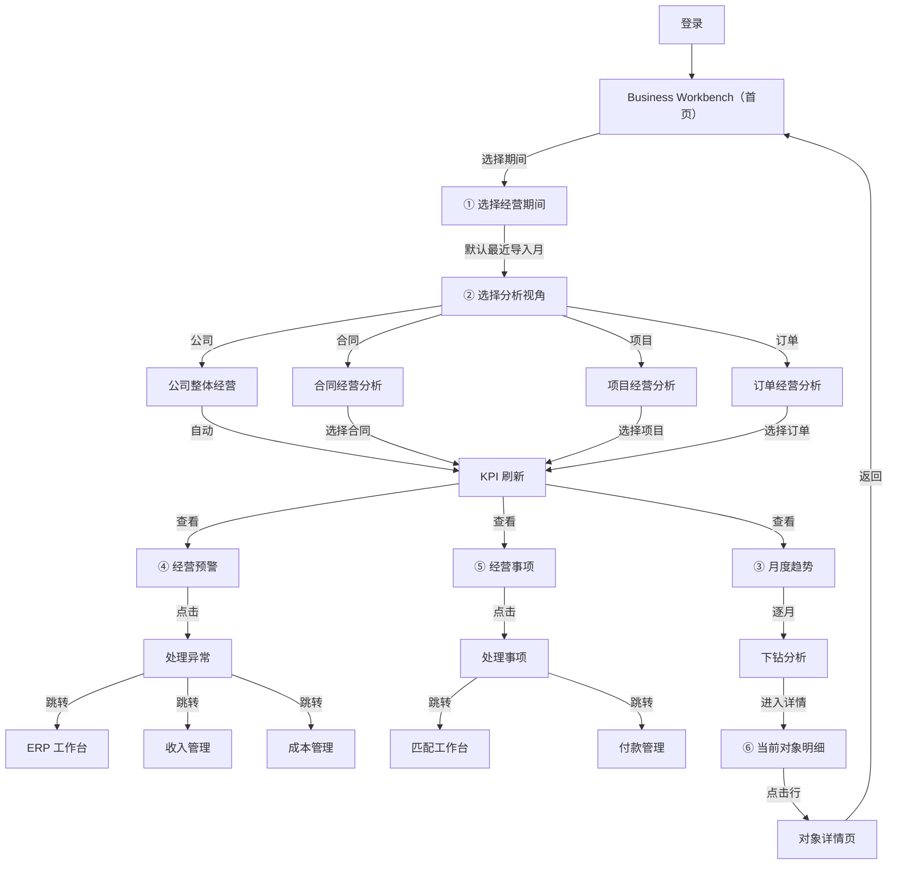

# Dashboard Flow — 经营分析流程

> **PDD-01 P4 输出 · 永久文档（Product SSoT）**
> 更新时间：2026-07-06
> **用户经营分析工作流。从登录到分析完成的全流程。**

---

## 一、完整分析流程



---

## 二、标准分析路径

### 路径 A：日常经营检查（5 分钟）

```
登录 → Business Workbench
  → 确认经营期间（默认）
  → 公司视角 → 查看 KPI
  → 查看月度趋势
  → 检查预警（如有则处理）
  → 退出
```

### 路径 B：合同经营分析（15 分钟）

```
登录 → Business Workbench
  → 选择经营期间（如 2026-06）
  → 切换视角到「合同」
  → 选择具体合同
  → 查看该合同的收入/成本/利润
  → 查看 Gap
  → 进入明细 → 详情页
  → 返回
```

### 路径 C：异常处理（30 分钟）

```
登录 → Business Workbench
  → 查看 Alerts（ERP 未匹配、Gap 过大）
  → 点击 Alert → 跳转 ERP 工作台
  → 完成匹配
  → 返回 Dashboard 验证
```

### 路径 D：月度经营分析（1 小时）

```
登录 → Business Workbench
  → 切换各个视角
  → 公司 → 合同 → 项目 → 订单
  → 分析各层 KPI
  → 查看趋势
  → 处理 Alerts
  → 处理 Actions
  → 导出分析报告
```

---

## 三、分析层次约束

| 方向 | 约束 |
|:-----|:------|
| 经营期间 | 必须选择 |
| 视角切换 | 公司 ↔ 合同 ↔ 项目 ↔ 订单（自由切换） |
| 对象选择 | 仅当视角不是"公司"时可选 |
| 数据联动 | 分析器改变 → 全局刷新 |
| 禁止反向 | 不能先选对象再选期间 |

---

## 四、Dashboard 区域联动

```
选择期间 ──→ 全部区域刷新
选择视角 ──→ KPI/Trend/Alert/Action/Detail 联动
选择对象 ──→ Detail 变为该对象明细
点击 Alert ──→ 跳转业务页面
点击 Action ──→ 跳转工作台
```

---

## 变更记录

| 版本 | 日期 | 变更说明 |
|------|------|---------|
| v1.0 | 2026-07-06 | 初始编制 |
