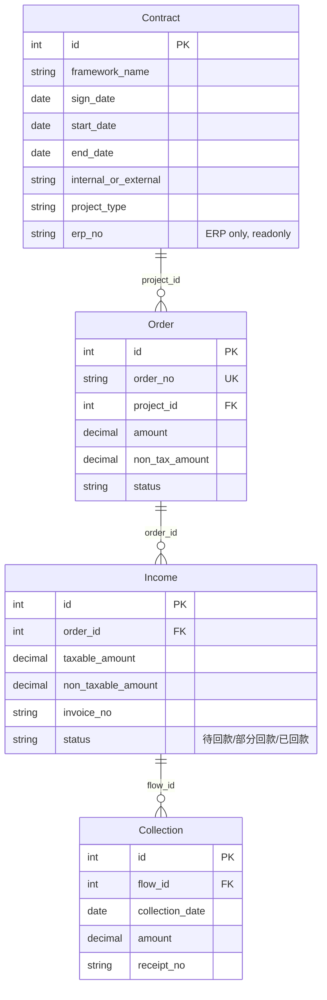
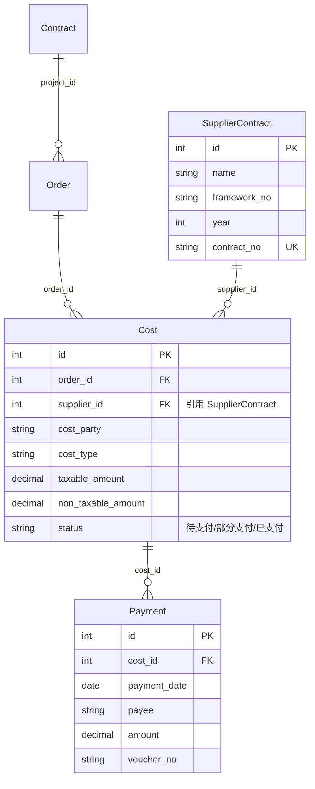
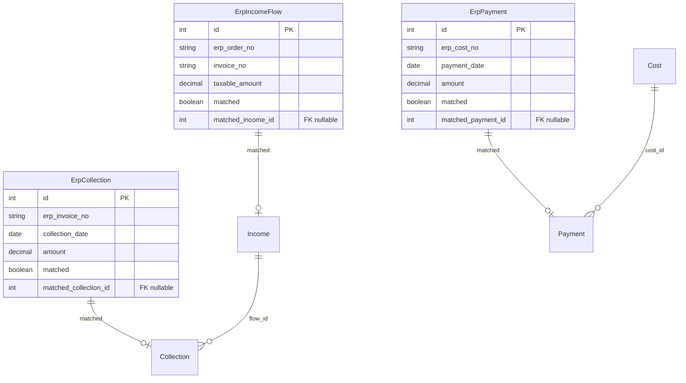
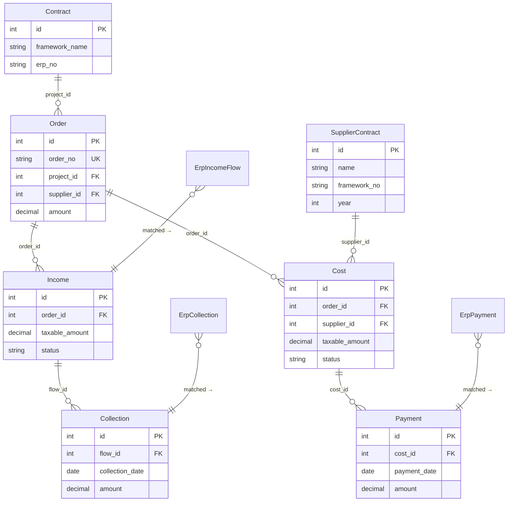

# Entity Relationship — FinanceDesk 业务 ER 图

> **BDD-00.8 P2 输出 · 永久文档（SSoT）**
> 更新时间：2026-07-04
> 交叉引用：[Business_Data_Model](./Business_Data_Model.md) · [Business_Rules](./Business_Rules.md)

---

## 一、核心业务 — 收入侧

> 合同 → 订单 → 收入 → 收款

**关系说明**：

| 关系 | 类型 | 约束 |
|------|:----:|------|
| Contract → Order | 1:N | `project_id` FK（RESTRICT） |
| Order → Income | 1:N | `order_id` FK（RESTRICT） |
| Income → Collection | 1:N | `flow_id` FK（RESTRICT） |

---

## 二、核心业务 — 成本侧

> 合同 → 订单 → 成本 → 付款

**关系说明**：

| 关系 | 类型 | 约束 |
|------|:----:|------|
| Contract → Order | 1:N | `project_id` FK |
| Order → Cost | 1:N | `order_id` FK |
| SupplierContract → Cost | 1:N | `supplier_id` FK（引用，不修改） |
| Cost → Payment | 1:N | `cost_id` FK |

---

## 三、ERP 集成

> ERP → 暂存表 → 匹配 → 业务表 → Dashboard

---

## 四、全量 ER 图

---

## 五、引用关系表

| 实体 | 引用对象 | 类型 | 说明 |
|------|---------|:----:|------|
| Order | Contract | FK | 订单必须归属合同（物理 FK） |
| Order | SupplierContract | FK | 订单可选关联成本供应商合同（物理 FK） |
| Income | Order | FK | 收入流水必须归属订单（物理 FK） |
| Cost | Order | FK | 成本流水必须归属订单（物理 FK） |
| Cost | SupplierContract | FK | 成本可选引用合同库单价（物理 FK） |
| Collection | Income | FK | 回款必须关联收入流水的 FK |
| Payment | Cost | FK | 付款必须关联成本流水的 FK |
| ErpIncomeFlow | Income | 逻辑 | ERP 数据匹配到业务收入 |
| ErpCollection | Collection | 逻辑 | ERP 数据匹配到业务收款 |
| ErpPayment | Payment | 逻辑 | ERP 数据匹配到业务付款 |

---

## 变更记录

| 版本 | 日期 | 变更说明 |
|------|------|---------|
| v1.0 | 2026-07-04 | 初始编制，4 张 Mermaid ER 图 |
