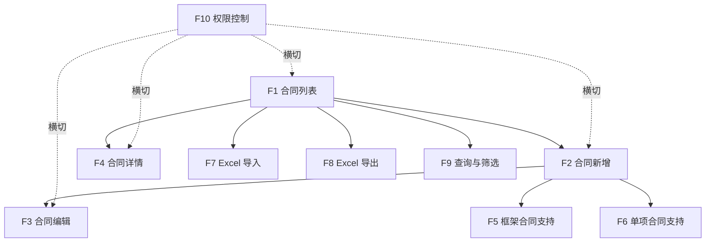

# Feature Dependency — 合同中心依赖图

> **BDD-01 Sprint Planning P2 输出**
> 更新时间：2026-07-04

---

## 一、依赖关系图



---

## 二、依赖矩阵

### 前置依赖关系

| Feature | 依赖项 | 说明 |
|:-------:|--------|------|
| F1 合同列表 | 无 | **起始 Feature** ✅ |
| F2 合同新增 | F1 | 需要列表页入口 |
| F3 合同编辑 | F2 | 需要先有新增功能 |
| F4 合同详情 | F1 | 需要从列表页跳转 |
| F5 框架合同支持 | F2 | 需要在新增时区分合同类型 |
| F6 单项合同支持 | F2 | 需要在新增时区分合同类型 |
| F7 Excel 导入 | F1 | 需要列表页有导入入口 |
| F8 Excel 导出 | F1 | 需要列表页有导出按钮 |
| F9 查询与筛选 | F1 | 需要列表页有筛选栏 |
| F10 权限控制 | 无 | 横切关注点，可并行开发 |

### 并行开发可能性

| 并行组 | Features | 说明 |
|--------|----------|------|
| 组 A | F9 | 可与 F2/F3/F4 并行（仅 UI 增强） |
| 组 B | F7 | 数据导入逻辑，可独立于前端调整 |
| 组 C | F10 | 权限，横切，可独立开发 |
| 组 D | F5 + F6 | 合同类型，需要先有 F2 |

---

## 三、关键路径

```
F1 → F2 → [F5 / F6] → F3 → F4
  ↘               ↘
   F9 (并行)       F7 / F8 (并行)
```

**关键路径总长**：F1 → F2 → F5/F6 → F3 → F4 = **5 步**

### 最小可行路径

如果需要进行 MVP 验证，最小路径为：

```
F1 → F2 → F3 → F4
```

**最小路径总长**：**4 步，约 14h**，可交付完整 CRUD 的合同中心。

---

## 四、推荐开发批次

| 批次 | Features | 依赖检查 | 产出 |
|:----:|----------|:--------:|------|
| **Batch 1** | F1 + F9 | ✅ 无前置依赖 | 合同列表 + 筛选 |
| **Batch 2** | F2 + F5 + F6 | ✅ F1 已完成 | 合同新增 + 框架/单项支持 |
| **Batch 3** | F3 + F4 | ✅ F2 已完成 | 编辑 + 详情 |
| **Batch 4** | F7 + F8 | ✅ F1 已完成 | 导入 + 导出 |
| **Batch 5** | F10 | ✅ 无依赖 | 权限控制 |

> **每批次完成后必须：Build → Tests → Regression → 审批 → 下一批。**
