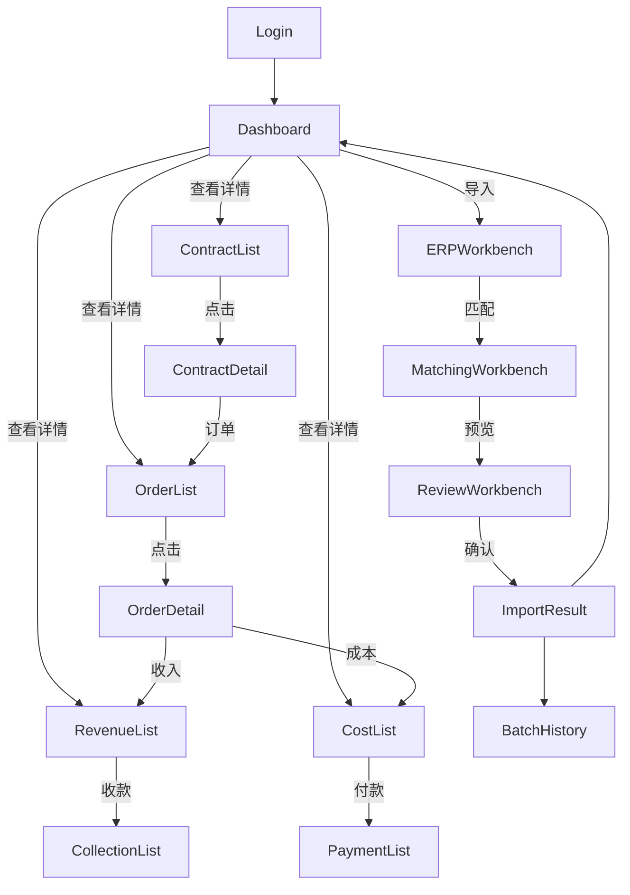

# FinanceDesk Product Blueprint — 产品蓝图

> **PDD-00 P1 输出 · 永久文档（Product SSoT）**
> 更新时间：2026-07-06
> **FinanceDesk 完整产品蓝图。仅设计，不开发。**

---

## ① 产品定位

FinanceDesk 是面向**中移建设崇左分公司**的**企业经营驾驶舱与结算管理平台**。

| 属性 | 值 |
|:----:|-----|
| 目标用户 | 项目经理、财务人员、管理层 |
| 核心价值 | 经营可视化 + 结算可追溯 + 导入可靠 |
| 使用频率 | 日活（Dashboard）、周活（合同/订单管理）、批处理（ERP 导入） |
| 终端 | 桌面浏览器（Web）为主，移动端预留 |

---

## ② 用户角色

| 角色 | 权限 | 主要页面 |
|:-----|:-----|:---------|
| **管理员** | 全部 | 系统管理、所有模块 |
| **项目经理** | 合同/订单/收入/成本/ERP | Dashboard、项目、订单、导入 |
| **财务人员** | 收入/成本/收款/付款/预算 | Dashboard、收入、成本、付款 |
| **阅览者** | 只读 | Dashboard、报表 |

---

## ③ 首页（Dashboard）

登录后默认进入 **Dashboard（经营驾驶舱）**。

```
┌─────────────────────────────────────────────────────────────┐
│ Header:  FinanceDesk         [🔔] [👤 一游] [⚙]          │
├─────────────────────────────────────────────────────────────┤
│ ┌─────────┐ ┌─────────────────────────────────────────────┐│
│ │ Sidebar │ │ Dashboard                                     ││
│ │         │ │ ┌──────┐ ┌──────┐ ┌──────┐ ┌──────┐         ││
│ │ 📊 看板  │ │ │收入  │ │成本  │ │利润  │ │Gap   │         ││
│ │ 📋 合同  │ │ │¥2.5M │ │¥1.8M │ │¥0.7M │ │¥0.3M │         ││
│ │ 📦 订单  │ │ └──────┘ └──────┘ └──────┘ └──────┘         ││
│ │ 💰 收入  │ │ ┌────────────────────────────────┐          ││
│ │ 🏭 成本  │ │ │ 经营趋势图                     │          ││
│ │ 📥 ERP   │ │ └────────────────────────────────┘          ││
│ │ 🤖 AI    │ │ ┌──────────┐ ┌──────────────────┐          ││
│ │ ⚙ 系统   │ │ │预警列表  │ │最近导入           │          ││
│ └─────────┘ │ └──────────┘ └──────────────────┘          ││
└─────────────┴─────────────────────────────────────────────┘
```

---

## ④ 一级菜单

| 菜单 | 图标 | 说明 |
|:-----|:----:|------|
| **Dashboard** | 📊 | 经营驾驶舱（首页） |
| **合同中心** | 📋 | 合同/项目管理 |
| **订单中心** | 📦 | 订单管理 |
| **收入中心** | 💰 | 收入流水/开票 |
| **成本中心** | 🏭 | 成本流水/供应商 |
| **ERP 中心** | 📥 | 导入工作台 |
| **AI 中心** | 🤖 | AI 分析（预留） |
| **系统管理** | ⚙ | 用户/字典/日志 |

---

## ⑤ 二级菜单

```
Dashboard
  └── 经营总览 / 收入看板 / 成本看板 / 预警

合同中心
  ├── 合同列表
  └── 合同详情

订单中心
  ├── 订单列表
  ├── 订单详情
  └── 订单管理

收入中心
  ├── 收入流水
  ├── 收款管理
  └── 收入报表

成本中心
  ├── 成本流水
  ├── 供应商管理
  ├── 付款管理
  └── 成本报表

ERP 中心
  ├── Import Workbench
  ├── Matching Workbench
  ├── Review Workbench
  └── Batch History

AI 中心（预留）
  ├── AI 分析
  ├── AI 预警
  └── AI 建议

系统管理
  ├── 用户管理
  ├── 字典管理
  ├── 操作日志
  └── 数据字典
```

---

## ⑥ 页面跳转关系



---

## ⑦ 全局导航

| 导航元素 | 位置 | 行为 |
|:---------|:-----|:------|
| **Sidebar** | 左侧 | 菜单展开/收起、当前高亮 |
| **Breadcrumb** | 顶部 | 显示当前路径 |
| **Header** | 顶部 | 系统名称 + 通知 + 用户 |
| **Toolbar** | 页面内 | 搜索/筛选/操作按钮 |
| **Back** | 详情页 | 返回列表页 |

---

## ⑧ 页面职责

| 页面 | 职责 | CRUD |
|:-----|:-----|:----:|
| Dashboard | 经营数据总览 | R only |
| ContractList | 合同列表 | R |
| ContractDetail | 合同详情 + 关联订单 | R |
| OrderList | 订单列表 | R |
| OrderDetail | 订单详情 + 流水 | R |
| ERPWorkbench | 导入→匹配→预览→确认 | C |
| BatchHistory | 导入历史 | R |
| AI Page | AI 分析界面 | R |

---

## ⑨ 页面生命周期

```
Open（打开页面）
  ↓
Loading（加载数据）
  ↓
Ready（可交互）
  ↓
  ├── User Action（搜索/点击/编辑）
  │       ↓
  │    Data Refresh（刷新数据）
  │       ↓
  │    Ready
  │
  └── Close（关闭页面）
```

---

## ⑩ AI 入口

| 入口位置 | 触发方式 | 用途 |
|:---------|:---------|:------|
| Dashboard 右上角 | 按钮 | 经营分析总结 |
| 订单详情页 | 按钮 | 订单风险分析 |
| ERP 导入结果页 | 自动 | 异常检测 |
| AI Center | 导航 | 深度分析 |

---

## 变更记录

| 版本 | 日期 | 变更说明 |
|------|------|---------|
| v1.0 | 2026-07-06 | 初始编制 |
