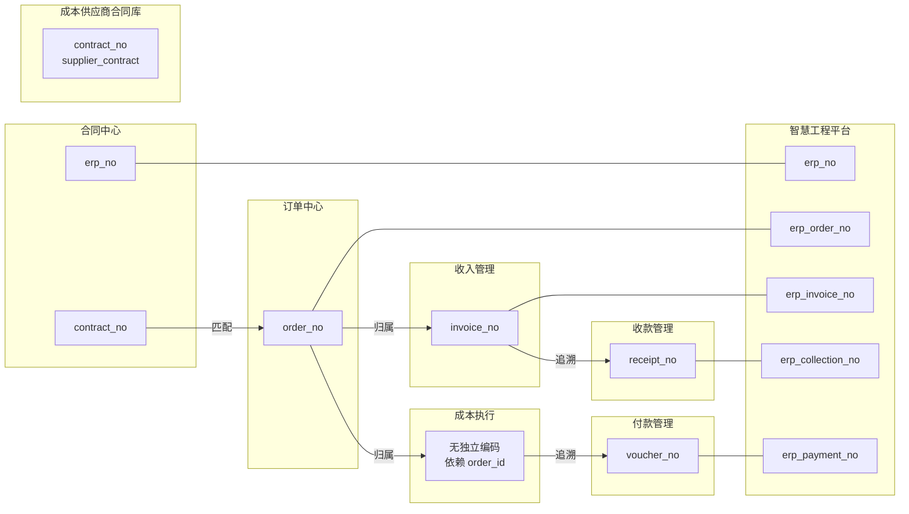

# Identity Matrix — 业务编码对应关系矩阵

> **BDD-02A.2 P2 输出 · 永久文档（SSoT）**
> 更新时间：2026-07-05

---

## 一、编码对应关系图



---

## 二、编码对应矩阵

### 2.1 核心业务编码

| FinanceDesk 对象 | FinanceDesk 编码 | ERP 编码 | 匹配关系 |
|-----------------|:----------------:|:--------:|---------|
| 合同 (Project) | `contract_no` | `erp_no`（辅助） | 合同编号与 ERP 项目编号独立记录，通过 `erp_no` 字段关联 |
| 订单 (Order) | `order_no` | `erp_order_no` | **ERP 按 `order_no` 精确匹配**（BDD-02A.1 确认） |
| 成本供应商合同 | `contract_no`（supplier_contract） | — | 不参与 ERP 匹配（Master Data） |

### 2.2 流水编码

| FinanceDesk 对象 | FinanceDesk 编码 | ERP 编码 | 匹配关系 |
|-----------------|:----------------:|:--------:|---------|
| 收入流水 (IncomeFlow) | `invoice_no` | `erp_invoice_no` | ERP 开票按发票号码匹配 |
| 成本流水 (CostFlow) | 无独立编码 | `erp_cost_no` | 按 `order_id + supplier_id` 模糊匹配 |
| 收款 (Collection) | `receipt_no` | `erp_collection_no` | ERP 回款按凭证号匹配 |
| 付款 (Payment) | `voucher_no` | `erp_payment_no` | ERP 付款按凭证号匹配 |

---

## 三、编码流向

### 正向流（FinanceDesk → ERP 核对）

```
contract_no ──→ order_no ──→ invoice_no ──→ receipt_no
                              └──→ voucher_no
```

### 逆向流（ERP → FinanceDesk 同步）

```
erp_no ──→ contract_no（辅助）
erp_order_no ──→ order_no（主要匹配）
erp_invoice_no ──→ invoice_no
erp_collection_no ──→ receipt_no
erp_payment_no ──→ voucher_no
```

---

## 四、匹配键优先级

| 业务场景 | 主匹配键 | 备选匹配键 |
|---------|:--------:|:----------:|
| 订单匹配 | `order_no` | 无备选 |
| 收入匹配 | `invoice_no` | `order_id + 金额` |
| 成本匹配 | 模糊匹配 | `order_id + supplier_id + 金额` |
| 收款匹配 | `receipt_no` | `flow_id + 金额` |
| 付款匹配 | `voucher_no` | `cost_id + 金额` |

---

## 变更记录

| 版本 | 日期 | 变更说明 |
|------|------|---------|
| v1.0 | 2026-07-05 | 初始编制 |
