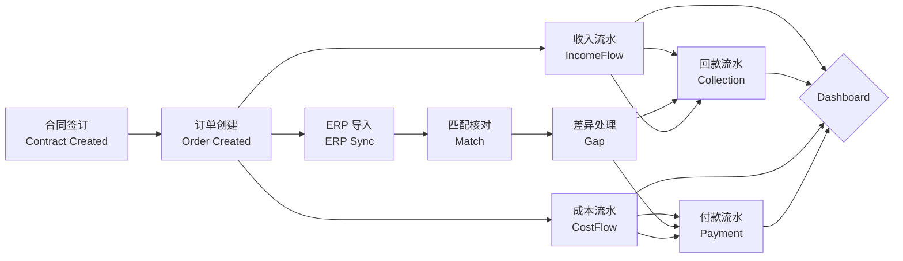
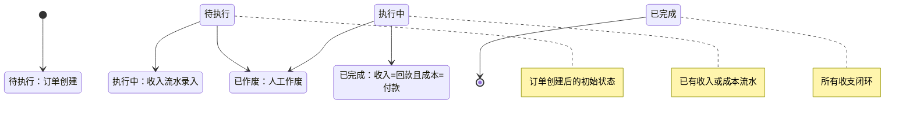
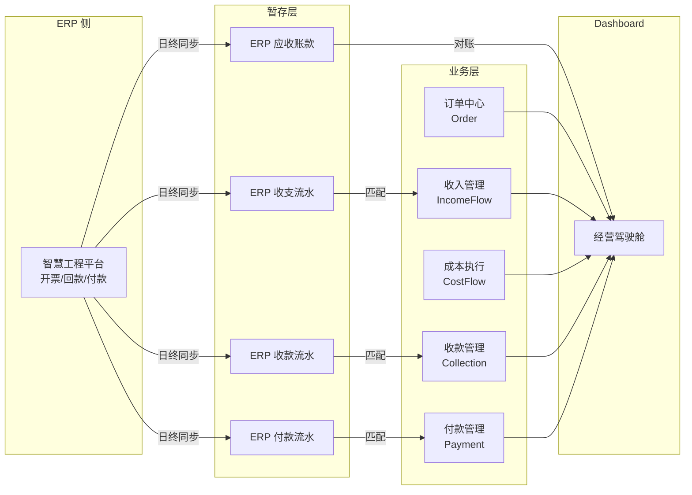

# Order Timeline — 订单生命周期

> **BDD-02A P3 输出 · 业务设计文档**
> 更新时间：2026-07-05
> 交叉引用：[Business_Rules §2](./Business_Rules.md) · [Business_Data_Model](./Business_Data_Model.md) · [Page_Flow](./Page_Flow.md)

---

## 一、主生命周期



## 二、订单状态推进



## 三、数据流向时间线

```
时间 →
─────────────────────────────────────────────────────────────────────

T0: 合同签订 ──→ Project 创建完成
T1: 订单创建 ──→ Order 创建，status = "待执行"
T2: 收入发生 ──→ IncomeFlow 录入，Order.status → "执行中"
T3: 成本发生 ──→ CostFlow 录入（可选）
T4: 回款到账 ──→ Collection 录入，IncomeFlow.status 自动更新
T5: 付款支出 ──→ Payment 录入，CostFlow.status 自动更新
T6: ERP 同步 ──→ ERP 数据导入暂存表
T7: 匹配核对 ──→ ERP 数据与业务数据匹配
T8: Gap 消除 ──→ 差异处理完成
T9: 订单完成 ──→ Order.status → "已完成"
```

## 四、关键状态规则

### 4.1 订单状态自动推导

| 条件 | 状态 | 设置方式 |
|------|:----:|:--------:|
| 刚创建，无流水 | 待执行 | 系统默认 |
| 至少 1 条收入或成本流水 | 执行中 | 系统自动 |
| 收入=回款 且 成本=付款 | 已完成 | 系统自动 |
| 用户手动终止 | 已作废 | 人工 |

### 4.2 流水状态自动推导

| 对象 | 条件 | 状态 |
|:----:|------|:----:|
| IncomeFlow | Collection.amount = 0 | 待回款 |
| IncomeFlow | 0 < Collection.amount < taxable_amount | 部分回款 |
| IncomeFlow | Collection.amount ≥ taxable_amount | 已回款 |
| CostFlow | Payment.amount = 0 | 待支付 |
| CostFlow | 0 < Payment.amount < taxable_amount | 部分支付 |
| CostFlow | Payment.amount ≥ taxable_amount | 已支付 |

### 4.3 Gap 定义

| Gap 类型 | 公式 | 正数含义 | 负数含义 |
|---------|------|---------|---------|
| 应收 Gap | 收入合计 - 回款合计 | 还有应收未收 | 多收（需核对） |
| 应付 Gap | 成本合计 - 付款合计 | 还有应付未付 | 多付（需核对） |
| 利润 Gap | 收入合计 - 成本合计 | 正向盈利 | 亏损 |

---

## 五、ERP 导入时间线



---

## 变更记录

| 版本 | 日期 | 变更说明 |
|------|------|---------|
| v1.0 | 2026-07-05 | 初始编制，4 张 Mermaid 图 |
