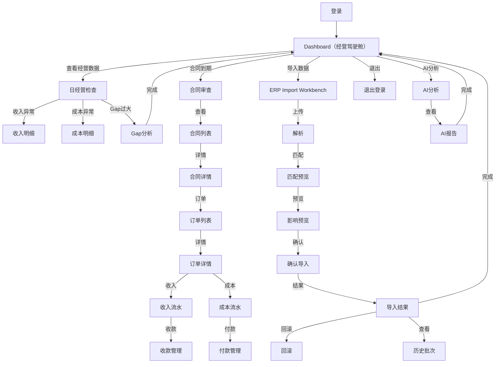

# Page Flow — 用户工作流

> **PDD-00 P6 输出 · 永久文档（Product SSoT）**
> 更新时间：2026-07-06
> **用户一天工作的完整流程。**

---

## 一、完整工作流



---

## 二、典型用户日流程

### 项目经理的一天

```
08:30  登录 → Dashboard
          ↓
08:35  查看经营总览（收入/成本/利润/Gap）
          ↓
08:40  Gap 过大 → 进入 GAP 分析
          ↓
08:50  合同到期审查 → 合同列表
          ↓
09:30  导入新 ERP 数据 → Import Workbench
          ↓
09:45  匹配确认 → 导入完成
          ↓
10:00  Dashboard 验证数据更新
          ↓
10:30  登出
```

### 财务人员的一天

```
09:00  登录 → Dashboard
          ↓
09:05  查看收入明细 → 检查开票
          ↓
09:30  收款核对 → 收款管理
          ↓
10:00  成本对账 → 成本明细
          ↓
10:30  付款审批 → 付款管理
          ↓
11:00  导入银行流水 → Import Workbench
          ↓
11:30  Dashboard 对账验证
```

---

## 三、页面跳转规则

| 跳转 | 方式 | 参数传递 |
|:-----|:-----|:---------|
| Dashboard → 明细页 | 点击卡片 | 日期范围/类型 |
| 列表 → 详情 | 点击行 | `record_id` |
| 详情 → 关联列表 | Tab 切换 | `order_id` |
| 详情 → 返回列表 | 返回按钮 | 保留搜索条件 |
| Workbench → 结果 | 步骤完成 | `batch_no` |

---

## 变更记录

| 版本 | 日期 | 变更说明 |
|------|------|---------|
| v1.0 | 2026-07-06 | 初始编制 |
