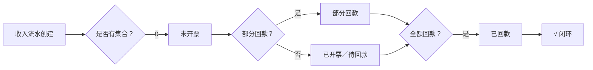

# Revenue Model — 收入对象模型

> **BDD-04A P1 输出 · 永久文档（SSoT）**
> 更新时间：2026-07-05
> 交叉引用：[Business_Data_Model §3](./Business_Data_Model.md) · [Order_Entry_Model](./Order_Entry_Model.md) · [Order_Timeline](./Order_Timeline.md)

---

## 一、收入对象定义

| 属性 | 值 |
|------|-----|
| 业务对象 | **收入（Revenue / IncomeFlow）** |
| 对应表 | `income_flow` |
| 归属层级 | **订单**（order_id FK） |
| 与 Order 关系 | N:1（一个订单可有多条收入流水） |
| 与 Collection 关系 | 1:N（一条收入流水可对应多次回款） |

### 字段定义

| 字段 | 类型 | PK | UK | NULL | 来源 | 说明 |
|------|------|:--:|:--:|:----:|:----:|------|
| id | Integer | ✅ | | | S | 主键 |
| order_id | Integer | | | | A | 🔗 关联订单（FK） |
| invoice_no | String(200) | | | ✅ | M/E | 发票号码 |
| taxable_amount | Numeric(15,2) | | | | M/E | 开票金额含税 |
| non_taxable_amount | Numeric(15,2) | | | | M/E | 开票金额不含税 |
| tax_rate | Numeric(5,2) | | | ✅ | M | 税率(%) |
| invoice_count | Integer | | | | M | 开票次数 |
| invoice_date | Date | | | ✅ | M/E | 开票时间 |
| remark | Text | | | ✅ | M | 备注 |

---

## 二、禁止维护字段

以下字段**不允许**在收入对象中维护，全部由 **Dashboard 自动推导**：

| 字段 | 维护位置 | 原因 |
|:----:|:--------:|------|
| 利润 | Dashboard | R006 自动计算 |
| Gap | Dashboard | R006 自动计算 |
| 回款率 | Dashboard | R006 自动计算 |
| 已完成 | Dashboard | 系统推导 |
| 已结清 | Dashboard | 系统推导 |
| 订单金额 | 订单中心 | 收入不维护订单数据 |

---

## 三、生命周期



---

## 四、与 Order 的关系

```
Order (1)
  └── IncomeFlow (N)     ← 一个订单可多次开票
       └── Collection (N) ← 一笔收入可多次回款
```

### 约束

| 规则 | 说明 |
|------|------|
| IncomeFlow 必须关联有效 Order | order_id FK（RESTRICT） |
| Collection 必须关联有效 IncomeFlow | flow_id FK（RESTRICT） |
| 收入金额 ≥ 0 | taxable_amount ≥ 0 |
| 开票次数 ≥ 1 | invoice_count ≥ 1 |

---

## 五、ERP 匹配规则

| 场景 | 匹配键 | 说明 |
|:----:|:------:|------|
| ERP 开票同步 | `invoice_no` | ERP 发票号码精确匹配 |
| 无发票号匹配 | `order_id + taxable_amount` | 按订单+金额模糊匹配 |
| 差异处理 | — | 标记差异，Dashboard 展示 |

---

## 变更记录

| 版本 | 日期 | 变更说明 |
|------|------|---------|
| v1.0 | 2026-07-05 | 初始编制 |
