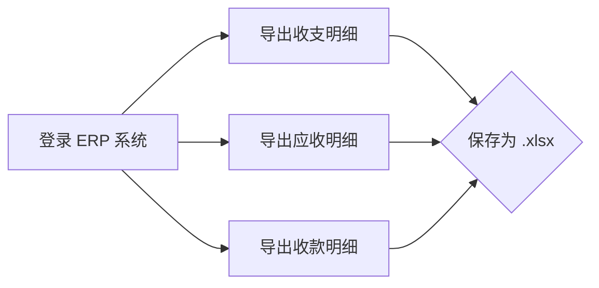

# Pilot Operation Guide — FinanceDesk V1

> PS-002 文档，面向实际操作人员的使用手册。从"开发文档"转向"使用文档"。

---

## 1. 总览

FinanceDesk 的核心使用者：

| 角色 | 系统登录 | 主要操作 |
|------|----------|----------|
| 财务 | 电脑浏览器 | ERP 导入、数据校验、关账 |
| 项目经理 | 电脑浏览器 | 订单录入、进度查看 |
| 企业负责人 | 电脑/手机 | Dashboard 查看、经营分析 |

---

## 2. 财务每月操作步骤

### 2.1 第 1 步：ERP 导出（每月 1–2 日）



**操作指引：**

1. 登录中移建设 ERP 系统
2. 进入「财务管理」→「凭证查询」
3. 选择期间：上个月（如当前是 7 月，选择 6 月）
4. 点击「批量导出」→ 选择 Excel (.xlsx) 格式
5. **导出 3 份文件**：
   - 收支明细 → 文件名: `{YYYY-MM}_收支.xlsx`
   - 应收明细 → 文件名: `{YYYY-MM}_应收.xlsx`
   - 收款明细 → 文件名: `{YYYY-MM}_收款.xlsx`
6. 保存到财务共享盘

> ⚠️ 注意：不要使用 WPS 打开导出文件再保存，可能导致格式变异。直接上传原始导出文件。

### 2.2 第 2 步：导入 FinanceDesk（每月 2–3 日）

1. 打开浏览器 → 登录 FinanceDesk
2. 左侧菜单 → 点击 **「ERP 导入」**
3. 在导入页面：
   - ① 点击「上传文件」
   - ② 选择 `{YYYY-MM}_收支.xlsx`
   - ③ 系统自动识别 Sheet 并展示预览
4. 重复以上步骤上传应收和收款文件

**文件上传完成后：**

```
上传 3 个文件后，Sandbox 中会显示:
  ┌──────────────────────────┐
  │  收支: 150 条            │
  │  应收: 80 条             │
  │  收款: 50 条             │
  │                          │
  │  总计: 280 条            │
  │                      确认导入│
  └──────────────────────────┘
```

### 2.3 第 3 步：检查并匹配（每月 2–3 日）

**自动匹配检查：**

1. 查看匹配状态汇总：
   - ✅ 自动匹配：系统已将部分流水匹配到项目
   - ⏳ 待匹配：需人工归集

2. 处理待匹配记录：
   - 点击「待匹配」标签
   - 查看每条记录的「摘要」和「项目名称」
   - 在右侧选择对应的 FinanceDesk 项目
   - 点击「确认匹配」

**金额核对：**

```
ERP 导出金额: ¥1,200,000.00
导入金额:     ¥1,200,000.00  ✅ 一致
待匹配金额:   ¥0.00  ✅ 全部已处理
```

### 2.4 第 4 步：确认导入（每月 3–4 日）

1. 确认所有待匹配记录已处理
2. 点击「确认导入」
3. 系统写入业务表，生成 `ImportBatch` 记录
4. 切换到 Dashboard 查看数据是否正确

**验证 Dashboard：**

```
打开 Dashboard
    ├── 确认本月收入数字 ≈ ERP 导出数字
    ├── 确认合同总数正确
    └── 确认无数据为 0 的异常模块
```

### 2.5 第 5 步：关账确认（每月 5 日）

1. 核对 Dashboard 数据无误
2. 导出月度经营报表（Dashboard 导出按钮）
3. 保存月度对账表到归档目录
4. 通知项目经理确认订单状态

---

## 3. 项目经理日常使用步骤

### 3.1 首次登录

1. 打开浏览器 → 登录 FinanceDesk
2. 默认进入 **Dashboard（经营看板）**
3. 快速查看：
   - 我的项目有多少个
   - 哪些项目在盈利
   - 哪些钱还没回来

### 3.2 录入新订单

```
项目 → 合同管理 → 找到对应合同
    ↓
点击「新增订单」
    ↓
填写：
    ├── 订单编号（按习惯填写，如 CG-2026-NNN）
    ├── 订单名称（如"XX 设备采购"）
    ├── 订单金额（含税）
    └── 负责人（默认自己）
    ↓
点击「保存」
```

### 3.3 查看订单经营详情

```
Dashboard → 项目经营 Tab
    ↓
找到自己的项目
    ↓
点击「进入工作台」
    ↓
查看：
    ├── 订单列表
    ├── 每个订单的收入/成本/利润
    ├── 哪些订单已回款
    └── 哪些订单还差多少钱
```

### 3.4 查看具体订单流水

```
订单工作台 → 点击订单编号
    ↓
打开 Drawer 查看：
    ├── 收入流水（开票记录）
    ├── 成本流水（支出记录）
    ├── 回款记录
    └── 付款记录
```

### 3.5 日常关注

| 关注项 | 查看位置 | 频率 |
|--------|----------|------|
| 订单收入确认 | Dashboard → 项目经营 | 每周 |
| 待回款订单 | Dashboard → 应收账龄 | 每周 |
| 利润异常 | Dashboard → 项目利润 | 每月 |
| 成本确认 | 订单工作台 | 每月 |

---

## 4. 企业负责人查看流程

### 4.1 快速查看经营概况

```
登录 FinanceDesk（默认 Dashboard）
    ↓
30 秒内掌握：
    ├── ① 本月经营情况（KPI）
    ├── ② 现金流趋势（Cash Flow）
    ├── ③ 哪些项目赚钱（项目利润 Tab）
    └── ④ 哪些钱没有回来（应收账龄 Tab）
```

### 4.2 调整分析范围

```
修改分析条件：
    ├── 经营期间：选择上个月 or 本季度
    ├── 分析维度：公司 / 合同 / 项目 / 订单
    └── 经营对象：选择具体合同或项目

修改后所有数据同步刷新。
```

### 4.3 深入查看

```
发现关注项 → 点击「进入工作台」
    ↓
查看对应合同的订单级经营数据
    ↓
点击订单 → 查看具体流水
```

### 4.4 导出经营数据

```
Dashboard → 点击「导出」
    ↓
选择导出范围：
    ├── 月度经营报表（PDF）
    └── 订单明细（Excel）
```

---

## 5. 常见问题

### 5.1 导入失败

| 问题 | 原因 | 解决 |
|------|------|------|
| "文件格式不支持" | 导出的不是 .xlsx | 重新导出，选择 .xlsx 格式 |
| "第 5 行金额格式错误" | 金额列包含非数字字符 | 检查原始数据，修正后重新上传 |
| "第 10 行日期无效" | 日期格式不对 | 确保日期格式为 YYYY-MM-DD |
| "凭证号重复" | 该条数据已导入过 | 确认是重复导入还是巧合，可跳过 |

### 5.2 Dashboard 数据不对

| 问题 | 原因 | 解决 |
|------|------|------|
| 收入数字不对 | 当月 ERP 未导入或导入不完整 | 检查导入批次记录 |
| 回款为 0 | 收款明细未导入 | 上传收款文件并匹配 |
| 项目总数不对 | 新合同未录入 | 在合同管理添加缺失的合同 |

### 5.3 权限问题

| 问题 | 说明 |
|------|------|
| 无法导入数据 | 联系 IT 启用 ERP 导入权限 |
| 无法新增订单 | 联系 IT 启用订单管理权限 |
| 无法查看 Dashboard | 默认所有登录用户可见 |

---

## 6. 技术支持

| 渠道 | 联系 | 响应时间 |
|------|------|----------|
| 系统问题 | IT 运维组 | 2 小时内 |
| 数据问题 | 财务负责人 | 工作日内 |
| 功能建议 | 通过系统反馈 | 试运行结束后统一评审 |
