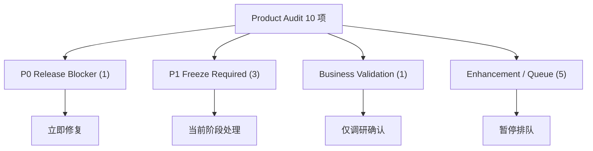

# RC-001 Hardening Plan

> **阶段**: RC-1 Hardening（发布加固）
> **Sprint**: RC-001
> **日期**: 2026-07-09
> **状态**: 进行中
> **声明**: 暂停所有新功能开发、Enhancement、新页面 Prototype

---

## 背景

Product Audit（2026-07-09）对 8 页 Frozen 页面执行了 FPS-1 七维度复审，发现：

| 页面 | 问题数 | 最严重问题 |
|:----:|:------:|:----------:|
| 预算管理 | 3 | 🔴 P0: `@ts-nocheck` |
| 收入管理 | 2 | 🟡 P1x2 |
| 收款管理 | 1 | 🟡 P1 + 🔍 Business Validation |
| 其余 5 页 | 0 | 无 P0/P1 问题 |

## 四类分类结果



## 处理顺序

```
┌─ P0: BudgetPage @ts-nocheck → 修复中
├─ P1: 收入管理 硬编码Select → 排队
├─ P1: 收入管理 空值显示0  → 排队
├─ P1: 收款管理 动态import  → 排队
├─ BV: 收款管理 编辑能力    → 调研中
└─ Enhancement: 5项         → 暂停
```

## 交付物

| 产出 | 路径 | 状态 |
|:----|:-----|:----:|
| Issue Classification | `docs/release/RC-001_Issue_Classification.md` | ✅ 已输出 |
| BudgetPage 修复 | `frontend/src/pages/BudgetPage.tsx` | 🔧 修复中 |
| 收入管理修复 | `frontend/src/pages/IncomeManagement.tsx` | ⏳ 待处理 |
| 收款管理修复 | `frontend/src/pages/CollectionManagement.tsx` | ⏳ 待处理 |
| FPS-1 Re-freeze | BudgetPage 重新冻结 | ⏳ 待处理 |
