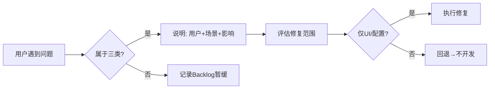

# FinanceDesk V1 Pilot — 试运行启动

> **状态**: 试运行就绪
> **日期**: 2026-07-09
> **版本**: V1.0-rc1
> **Sprint 冻结**: 暂停所有开发 Sprint，进入 Pilot 验证

---

## 当前系统状态

### 已冻结页面（8 页）

| 页面 | 版本 | 状态 | 上次审计 |
|:----|:----:|:----:|:--------:|
| Dashboard | V1.0 | ✅ Frozen | 2026-07-09 |
| 合同管理 | V1.0 | ✅ Frozen | 2026-07-09 |
| 订单管理 | V1.0 | ✅ Frozen | 2026-07-09 |
| 收入管理 | V1.0 | ✅ Frozen | 2026-07-09 |
| 成本执行 | V1.0 | ✅ Frozen | 2026-07-09 |
| 收款管理 | V1.0 | ✅ Frozen | 2026-07-09 |
| 付款管理 | V1.0 | ✅ Frozen | 2026-07-09 |
| 预算管理 | V1.0 | ✅ Frozen | 2026-07-09 |
| 数据字典 | V1.0 | ✅ Frozen | 2026-07-09 |

### 已完成的优化（RC 系列）

| 阶段 | 内容 | 日期 |
|:----|:-----|:----:|
| RC-001 Hardening | P0/P1 修复、BudgetPage @ts-nocheck 清零 | 07-09 |
| RC-001.2 Workload Reduction | 9 项默认值/自动计算优化 | 07-09 |
| RC-002 Biz Analysis Platform | 4 页面可点击关联跳转 | 07-09 |
| RC-003 Business Flow Audit | 合同 Drawer 订单跳转、KPI 导航 | 07-09 |
| RC-004 Context Consistency | 4 页面 Analyzer project_id 继承 | 07-09 |

---

## 业务链导航（已验证）

```
Dashboard                                 ← 首页入口
  │
  ├→ 合同管理 → Drawer(订单列表) → 订单管理  ← F1: 合同→订单
  │     │                                  ← F3: 合同KPI可跳转
  │     └→ 收入/成本/回款/付款
  │
  ├→ 订单管理 → KPI(收入/成本/回款/付款)    ← F2: 订单KPI可跳转
  │     │
  │     └→ Drawer(订单详情/5Tab)
  │
  ├→ 收入管理 → 订单名称可点击→订单管理      ← RC-002: 可点击关联
  ├→ 成本执行 → 订单名称可点击→订单管理      ← RC-002
  ├→ 收款管理 → 关联流水可点击→订单管理      ← RC-002
  └→ 付款管理 → 关联流水可点击→订单管理      ← RC-002
```

**上下文连续性**: 选择项目后跳转任意流水页面，自动继承筛选条件 ✅

---

## 数据验证

### 后端 API（已注册 15+ Router）

| 端点 | 用途 | 状态 |
|:-----|:-----|:----:|
| `GET /api/v1/projects` | 合同 CRUD | ✅ |
| `GET /api/v1/orders` | 订单 CRUD | ✅ |
| `GET /api/v1/income-flows` | 收入流水列表 | ✅ |
| `GET /api/v1/cost-flows` | 成本流水列表 | ✅ |
| `GET /api/v1/collections` | 回款列表 | ✅ |
| `GET /api/v1/payments` | 付款列表 | ✅ |
| `GET /api/v1/dashboard/summary` | Dashboard 汇总 | ✅ |
| `POST /api/v1/import/*` | 6 套导入模板 | ✅ |
| `GET /api/v1/search/business` | 统一搜索 | ✅ |

### 导入模板（6 套）

| 模板 | 验证状态 |
|:-----|:--------:|
| Contract_Template.xlsx | ✅ |
| Order_Template.xlsx | ✅ |
| Revenue_Template.xlsx | ✅ |
| Cost_Template.xlsx | ✅ |
| Collection_Template.xlsx | ✅ |
| Payment_Template.xlsx | ✅ |

---

## Pilot 试运行规则

### 禁止

- ❌ 新增功能页面
- ❌ 新增数据库字段
- ❌ 新增录入项
- ❌ 新增 API 端点
- ❌ 新 UI Sprint

### 允许

仅接受以下三类问题的修复：

```
① 业务流断点
   用户: 项目经理
   场景: 流程通不了
   标准: 必须从 A 到 B 的操作链路中断

② 经营分析理解问题
   用户: 经营分析人员
   场景: 数字看不懂、找不到
   标准: 已存数据无法理解或定位

③ 试运行效率问题
   用户: 实际使用中
   场景: 操作太慢、步骤太多
   标准: 真实用户证明 > Excel 同类操作耗时
```

### 问题提交流程



### 每个问题必须回答

```
用户是谁:     _______
在什么过程中:  _______
为什么影响使用: _______
属于哪类:     (1)业务流断点 / (2)理解问题 / (3)效率问题
修复范围:     仅UI层 / 涉及后端 / 涉及数据库
```

### 排除示例

| ❌ 不接受的变更 | 原因 |
|:---------------|:-----|
| 新增"经营风险分析"页面 | 新功能 |
| 在订单表加"实际毛利"字段 | 新字段 |
| 重构 Dashboard 布局 | UI Sprint |
| 新增 Dashboard 导出 | 不阻断使用 |

| ✅ 可接受的变更 | 理由 |
|:---------------|:-----|
| 报表数字格式不对 | 理解问题 |
| 列表到详情点击无反应 | 业务流断点 |
| 导入 1000 条超时 | 效率问题 |

---

## Pilot 启动检查清单

| # | 检查项 | 状态 |
|:-:|:-------|:----:|
| 1 | tsc --noEmit 零错误 | ✅ |
| 2 | vite build 成功 | ✅ |
| 3 | 8 页已冻结 | ✅ |
| 4 | 6 套导入模板 | ✅ |
| 5 | 业务链导航连通 | ✅ |
| 6 | Analyzer 上下文继承 | ✅ |
| 7 | 9 项工作量优化 | ✅ |
| 8 | 无 P0/P1 开放问题 | ✅ |
| 9 | Pilot 规则文档 | ✅ |
